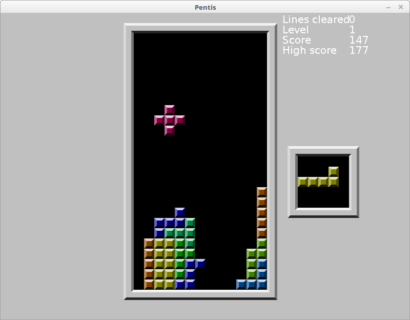

HFL Falling 5-blocks (Pentis)
=============================

[ Encoding: UTF-8; Syntax: GitHub Flavored Markdown ]:#

Puzzle game similar to Tetris, but with pieces made of 5 blocks, instead of 4;
and with ability to mirror pieces horizontally and vertically.

Originally created in 2011. Imported into version control in 2020.

Cleanup pending.

[MIT License][]
---------------

[Changelog][]
-------------

Setup
-----

1. Install Java Runtime Environment (JRE).
2. Download the following files to the same directory:
   - [`./Pentis Latest/block.png`](./Pentis%20Latest/block.png)
   - [`./Pentis Latest/Pieces`](./Pentis%20Latest/Pieces)
   - [`./Pentis Latest/playPentis.jar`](./Pentis%20Latest/playPentis.jar)

Launching The Game
------------------

1. Open a command-line in the directory the game was downloaded to.
2. Run: `java -jar playPentis.jar`

How To Play
-----------

- (Keys can be changed in the menu.)
- Use `P` key to pause and unpause the game.
- Use the horizontal arrow keys (`←` & `→`) to steer the falling piece.
- Use `V` key to turn the piece clockwise.
- Use `C` key to turn the piece counterclockwise.
- Use `X` key to mirror the piece horizontally.
- Use `Z` key to mirror the piece vertically.
- Use down arrow key (`↓`) to speed up falling (also known as "soft drop").
- Use space bar to instantly drop the piece all the way down (also known as
  "hard drop").
- Try to get as many points as possible.
  - Try to fill a row with blocks (with no gaps) to clear it, and to get points.
    - Try to fill multiple rows at once to get more points.
  - The game ends if the blocks reach the top of the field and prevent the next
    piece from coming.
- The small square right of the field shows the next piece.

[Changelog]: ./CHANGELOG.md
[MIT License]: ./LICENSE.md
